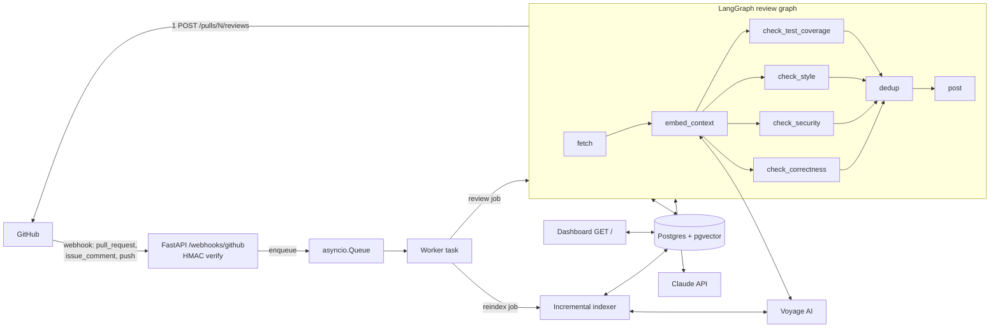

# Architecture

## System diagram

## Components

**Webhook layer** (`codereview/web/webhooks.py`): A FastAPI route at `POST /webhooks/github` that reads the raw request body, verifies the `X-Hub-Signature-256` HMAC before parsing JSON, then routes by event type. `pull_request` events with actions `opened`, `synchronize`, or `reopened` enqueue a `ReviewJob`; `issue_comment` events that begin with `/review again` from OWNER/MEMBER/COLLABORATOR enqueue a forced review; `push` events to the default branch enqueue a `ReindexJob`. All accepted events return 202 immediately; a full queue returns 503.

**Worker** (`codereview/worker.py`): A single `asyncio.Queue` (max 100 items) consumed by one background task started at app startup. Each job runs under `asyncio.timeout(120)`. Failures are caught, logged at ERROR, and recorded in the `reviews` table — the consumer never crashes. On shutdown the worker task is cancelled and the current job finishes before the process exits.

**GitHub client** (`codereview/github/client.py`): An async httpx client scoped to the configured repository. Handles rate-limit back-off (403 with `x-ratelimit-remaining: 0` or 429), retries once after `Retry-After`/reset (capped at 60 s). Provides: `get_pr`, `get_pr_diff`, `get_file`, `get_default_branch`, `list_reviews`, `create_review`, `list_recent_review_comments`, `get_tarball`.

**RAG layer** (`codereview/rag/`): Voyage AI `voyage-code-3` embeddings (1024-dim) stored in pgvector. Three source types: `code` (file chunks), `style` (style guide chunks), and `pr_comment` (historical review comments). The `Embedder` wraps the Voyage client with batching and retry. The `ChunkStore` upserts/deletes/searches chunks via cosine similarity. The `Indexer` seeds from a repo tarball or re-indexes changed paths on push. The `Retriever` runs per-file code queries and a global style/comment query, returning up to 6 000 tokens of context per review.

**Agent graph** (`codereview/agent/graph.py`): A LangGraph `StateGraph` compiled once at startup. Nodes: `fetch` (idempotency check, PR metadata, diff, preflight cost estimate) → `embed_context` (RAG retrieval) → four parallel check nodes (`check_correctness`, `check_security`, `check_style`, `check_test_coverage`) → `post` (dedup, compose, single review POST, metrics). The fan-out after `embed_context` is a LangGraph parallel superstep; all four check nodes run concurrently.

**Dedup** (`codereview/agent/dedup.py`): Pure functions applied in the `post` node. Pipeline: (1) filter by `severity_threshold`; (2) snap each finding to the nearest changed line in the diff; (3) group findings within ±3 lines on the same file, keeping the highest-quality finding per group; (4) sort by severity then category; (5) cap inline comments at 7 — overflow moves to the review body summary.

**Cost guard** (`codereview/agent/cost.py`): A price table for the three supported models. A preflight estimate runs in `fetch` before any model call; if the estimate × 1.3 exceeds `COST_CEILING_USD` the job is aborted (`cost_preflight`). After all checks run the `post` node computes actual cost from token usage; if it exceeds the ceiling the review is not posted (`cost_exceeded`). Default ceiling: $0.50.

**Dashboard** (`codereview/web/dashboard.py`): A server-rendered `GET /` page backed by the `reviews` table. Shows the 50 most recent reviews, aggregate cost, cost per review, p50/p95 latency, and an SVG cost-per-PR chart with the cost ceiling overlaid. `GET /healthz` returns JSON with a DB ping result. The dashboard has no authentication.

## Data model

Three tables, all created idempotently at startup from `codereview/schema.sql`:

- **`chunks`** — embedding store owned by the RAG layer. Columns: `source_type` (`code` | `style` | `pr_comment`), `path`, `start_line`, `end_line`, `content`, `embedding` (vector 1024), `commit_sha`, `indexed_at`. HNSW cosine index on `embedding`.

- **`reviews`** — one row per completed review job, written exclusively by the agent graph and worker error handler (single writer). Columns: `repo`, `pr_number`, `head_sha`, `status` (`queued` | `running` | `completed` | `skipped` | `failed` | `cost_exceeded`), `trigger`, `model`, `findings_total`, `comments_posted`, `input_tokens`, `output_tokens`, `cost_usd`, `duration_ms`, `error`, `created_at`, `completed_at`.

- **`index_state`** — one row per repo tracking the last indexed commit SHA and timestamp. Used by the incremental indexer to avoid redundant work.

## Review lifecycle

1. GitHub delivers a webhook event to `POST /webhooks/github`.
2. HMAC signature verified; payload parsed; event routed to a `ReviewJob`.
3. Worker enqueues the job; webhook returns 202 within milliseconds.
4. Consumer pulls the job; `run_review` invokes the LangGraph graph.
5. `fetch` node: idempotency check (DB + marker scan), fetch PR metadata and diff, load `.codereview.yml`, preflight cost estimate.
6. `embed_context` node: RAG retrieval (per-file code chunks + global style/comment chunks).
7. Four check nodes run concurrently (LangGraph parallel superstep): correctness, security, style, test coverage — each calls Claude once.
8. `post` node: dedup → compose review body → single `POST /pulls/N/reviews` to GitHub.
9. Worker records the outcome row in `reviews` (status, token counts, cost, duration).

## Design decisions

**In-process queue and restart tradeoff.** Using a single `asyncio.Queue` in the same process as the HTTP server avoids the operational overhead of a separate job broker. The tradeoff is that in-flight reviews are lost on container restart. This is acceptable because all reviews are idempotent by SHA and can be re-triggered with `/review again`.

**Single-writer review records.** The `reviews` table has exactly one writer path per job: either the `post` node (on success) or the worker's error/timeout hook. This prevents double-writes and makes the table a reliable audit log.

**Marker-based idempotency.** The `fetch` node checks both the `reviews` table and the live review list for a marker comment `<!-- ai-code-review:v1 sha={sha} -->` embedded in every posted review. This dual check survives a DB reset or migration: the marker in GitHub's review history is the ground truth.

**Dynamic fencing (`force=True`).** The `/review again` slash command sets `force=True` on the job, bypassing the idempotency check. This gives collaborators an explicit escape hatch without requiring a new commit.

**"3–7 comments" as cap-not-quota.** The `apply_dedup` function caps inline comments at 7 (the `max_inline` parameter). This is a ceiling, not a target — a short diff with one genuine finding produces one comment.

## Upgrade path

Replace the in-process `asyncio.Queue` with a DB-backed job table (e.g., a `jobs` table with `status`, `payload`, `claimed_at`). Workers poll or use `LISTEN`/`NOTIFY`. This survives restarts without losing jobs and allows horizontal scaling to multiple workers.
