# CodeGuardian Frontend

The web UI for the AI Code Review Agent — a Next.js 16 (App Router) + React 19 +
Tailwind v4 + shadcn/ui dashboard. Dark, repository-aware, fully responsive.

It runs against a typed API client (`src/lib/api/client.ts`) backed by deterministic mock
data, so every screen renders and demos with **no backend required**. When the backend's
`/api/*` endpoints exist, set `NEXT_PUBLIC_USE_MOCKS=false` and the same client targets them.

## Run

```bash
npm install
npm run dev      # http://localhost:3000
# or: npm run build && npm run start
```

Other scripts: `npm run lint`, and `npm run screenshots` (captures the gallery below via
Playwright against a running `next start` on port 3100 — see `scripts/capture-screenshots.mjs`).

## Screens

| Landing | Dashboard |
|---|---|
| 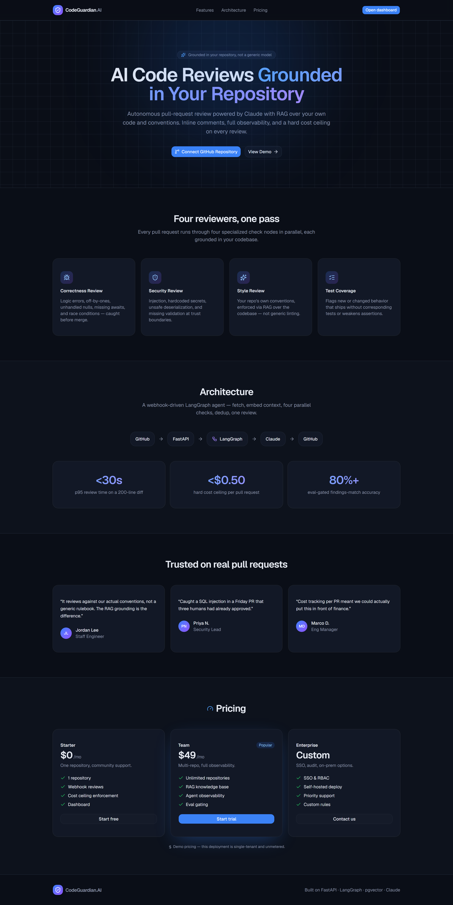 | 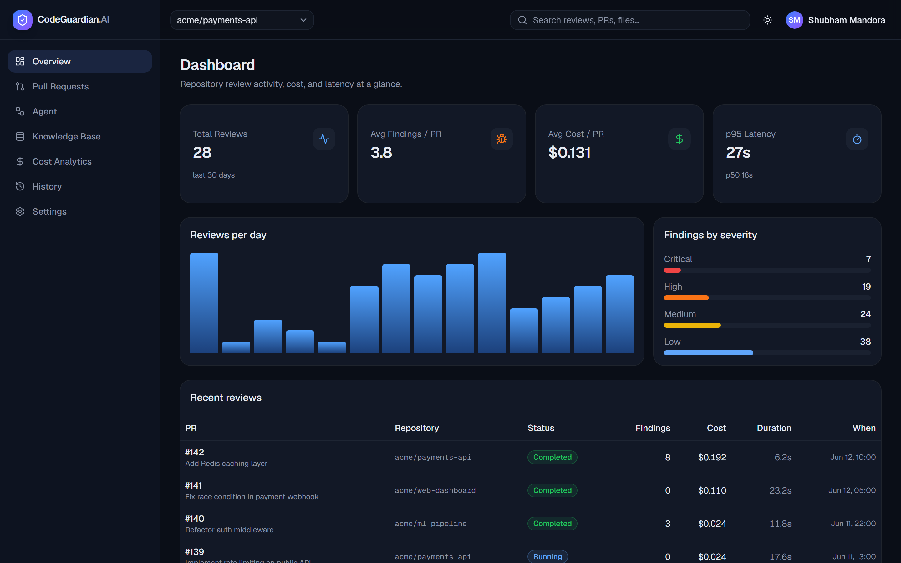 |

| Pull Requests | Pull Request Analysis |
|---|---|
| 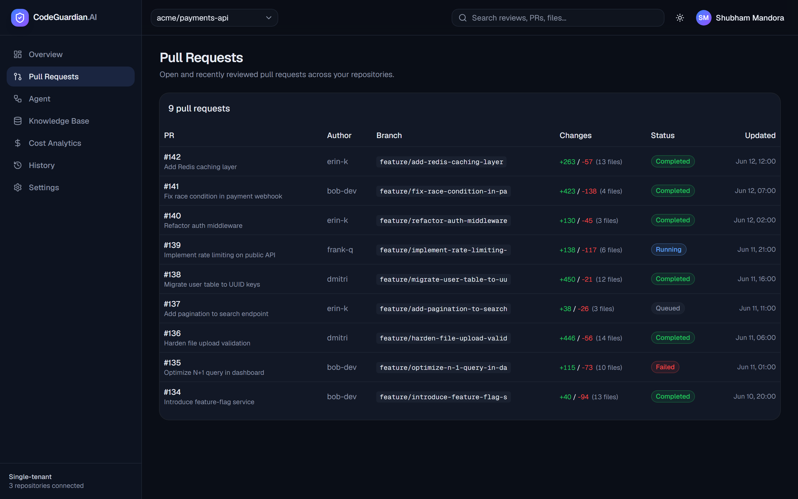 | 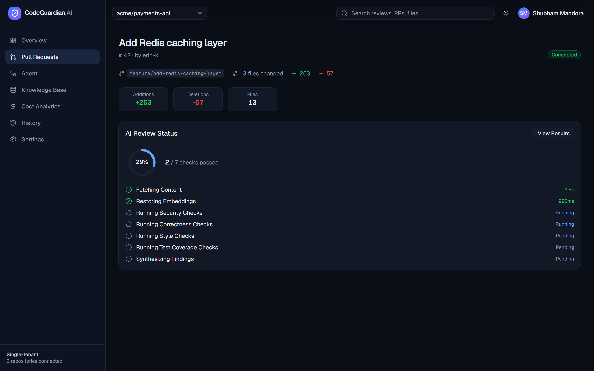 |

| AI Review Results | LangGraph Agent Visualization |
|---|---|
| 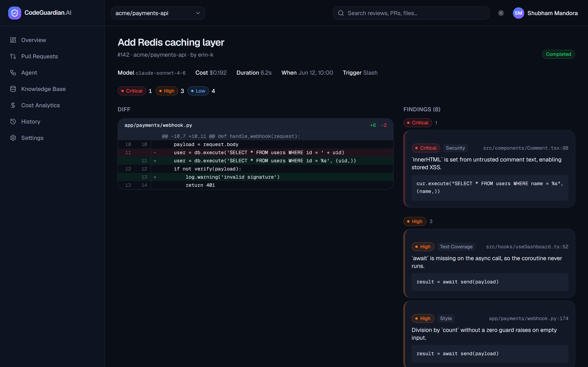 | 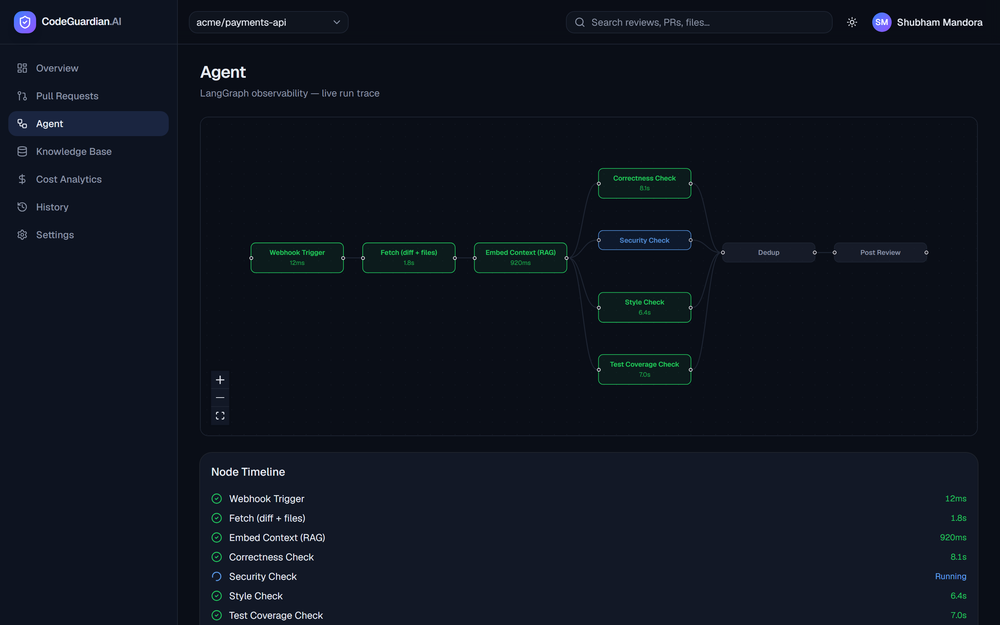 |

| Knowledge Base & RAG Explorer | Cost Analytics |
|---|---|
| 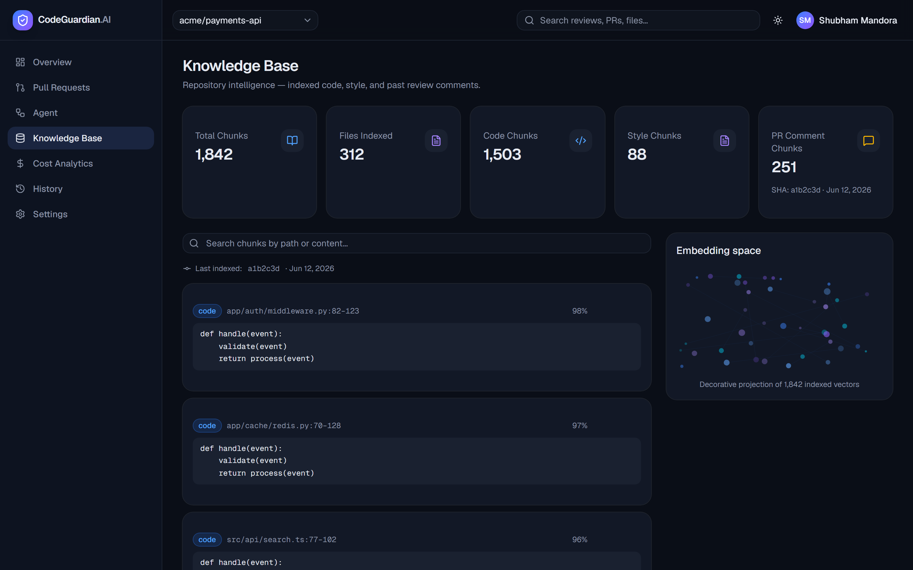 | 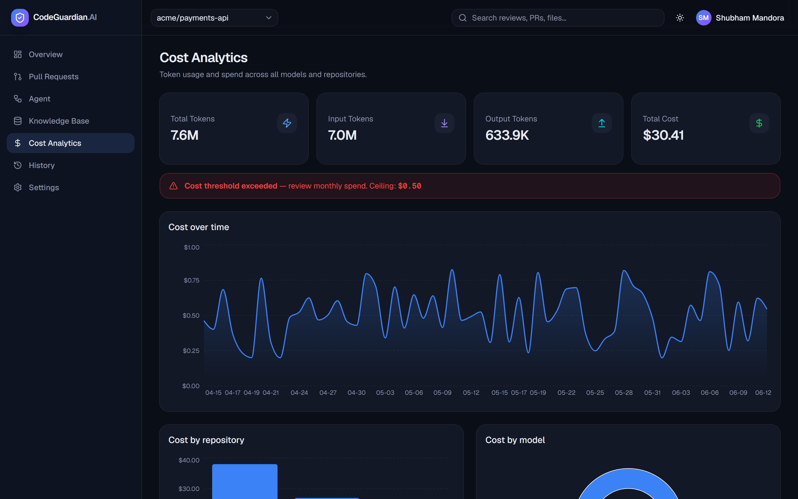 |

| Review History | Settings |
|---|---|
| 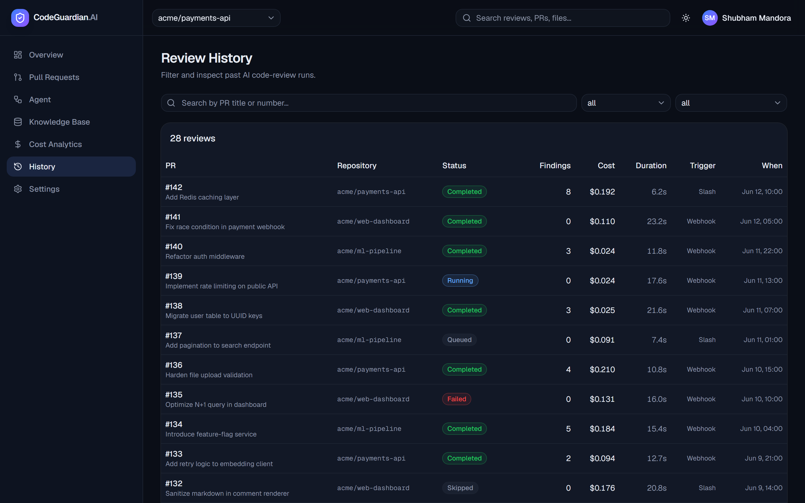 | 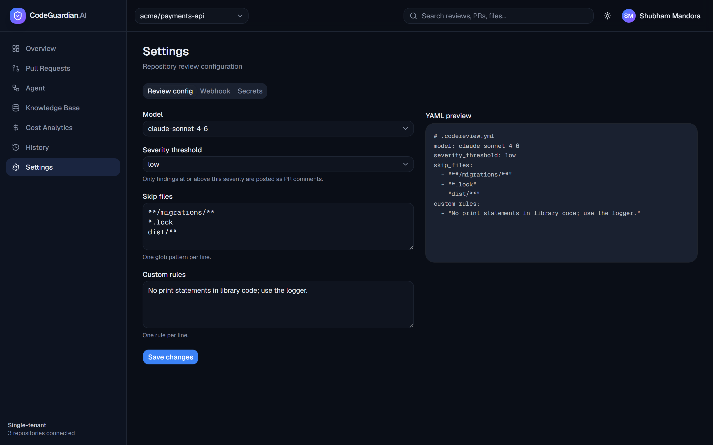 |

**Mobile (responsive):**

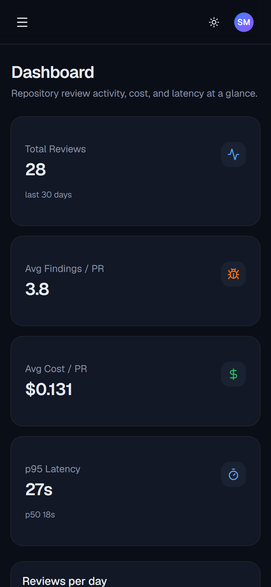

## Stack

Next.js · React · TypeScript · Tailwind v4 · shadcn/ui (Base UI) · Recharts · React Flow
(`@xyflow/react`) · next-themes · lucide-react. See
[`docs/superpowers/specs/2026-06-12-frontend-design.md`](../docs/superpowers/specs/2026-06-12-frontend-design.md)
for the design spec and the deferred backend-wiring phase.
